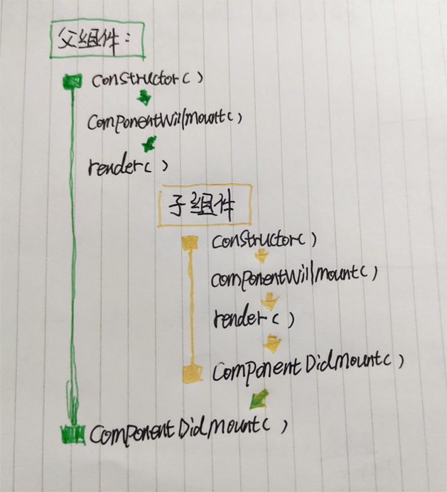
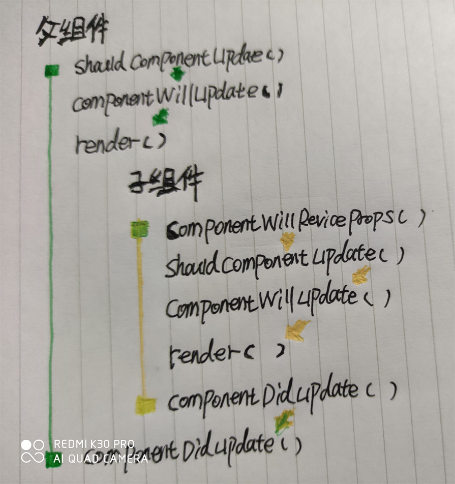
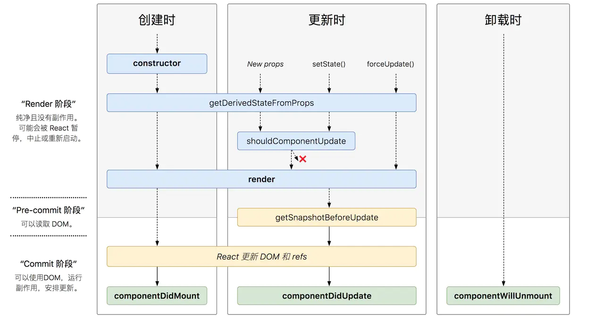

# React-Life-Cycle

## 旧版生命周期


React 的生命周期主要可以分为三种阶段：挂载时、更新时、卸载时。

**挂载时(Mounting)**
当组件初次挂载时，会依次触发以下的生命周期函数：

1. constructor()
2. componentWillMount()
3. render()
4. componentDidMount()

**更新时(Updating)**
当组件的状态(state)以及属性(props)发生变更时，会触发组件的更新生命周期，其顺序如下：

1. componentWillReceiveProps()
2. shouldComponentUpdate()
3. componentWillUpdate()
4. render()
5. componentDidUpdate()

**卸载时(UnMounting)**
当组件执行完毕被销毁时，会触发该类型的生命周期

1. componentWillUnmount()

## 生命周期流程

React 生命周期的执行过程类似于 `Express` 的洋葱模型，也类似于 React Diff 算法中的深度优先。

当父组件执行到 render 的时候会进入子组件的整个生命周期，当子组件的整个生命周期都执行完毕则会跳出到父组件 render 之后的生命周期继续执行，如果存在多层嵌套的父子孙组件，则依次类推。

当父子组件 Mounting 时：



当父子组件 Updating 时:



需要注意的是：

- 当父组件 `Updating` 时，其子组件也会 `Updating` 。
- 当子组件 `Updating` 时，其父组件不受任何影响。
- setState() 方法的第二个参数即回调函数会在整个 Updating 生命周期都执行完毕后才会执行。

## 新版生命周期



新版的生命周期对比于旧版的生命周期，主要废除了以下三个生命周期方法：

- componentWillMount()
- componentWillReceiveProps()
- componentWillUpdate()

废除的原因是因为这三个生命周期经常会被误解和滥用。
对比于废弃了的生命周期，React 新增了两个生命周期，分别是：

- getDerivedStateFromProps()
- getSnapshotBeforeUpdate()

新版本生命周期的每个阶段：

**挂载时(Mounting)**

1. constructor()
2. static getDerivedStateFromProps()
3. render()
4. componentDidMount()

**更新时(Updating)**

1. static getDerviedStateFromProps()
2. shouldComponentUpdate()
3. render()
4. getSnapshotBeforeUpdate()
5. componentDidUpdate()

下面对新版本生命周期进行详细讲解

**getDerivedStateFromProps**

翻译过来的意思就是源于父组件的 props 来获得当前组件的 state。而专业一点解释则是将父组件传递的 props 映射到当前组件的 state 上，这样子组件内部就不需要每次都是通过 `this.props.xxx` 获取，而是直接从自身的状态上读取。

在 `getDerivedStateFromProps` 生命周期中根据父组件的 props 派发组件状态，如果父组件的 props 没有发生改变，则可以返回 null，需要注意的派发组件状态是合并覆盖而不是单纯的覆盖。

```jsx
static getDerivedStateFromProps(nextProps,preveState){
    if(nextProps.gaid != preveState.gaid){
        return {
            gaid:nextProps.gaid
        }
    }

    return null; //表示父组件的props没有变化无需更改子组件的状态。
}
```

**shouldComponentUpdate**
该生命周期只能用于 `Component` 类型的组件中，返回 `false` 拦截组件渲染。不在执行 `render` 及之后的生命周期方法。
对比于 `diff` 算法只是用于确定新旧节点树之间的区别，然后进行节点更新，其特点就是替代了传统 jquery 时期手动 DOM 节点的操作，因此 `diff` 算法的主要功能还是保证 DOM 节点不会被随意更新，并不能确保一些 `updating` 状态下的生命周期方法不会再被执行一遍，因此为了更大的提升性能，通常我们都会在此生命周期方法中进行 `state` 或 `props` 变更的判断。

```js
shouldComponentUpdate(nextState,nextProps){
    return (!equal(this.props,nextProps) || !equal(this.state,nextState))
}
```

`React.PureComponent` 已经自带了该生命周期方法，但只做到了对基本数据类型值的变更判断，如果是引用类型的数据变更，哪怕对象的值是完全相同的依然会触发 `updating` 阶段的生命周期方法。

**getSnapshotBeforeUpdate**


## 相关问题

### shouldComponentUpdate 的调用时机

如果明确知道组件不会轻易被修改，那么使用 `PureComponent` 类型的组件，进行自动的浅比较即可。
如果明确知道组件会被修改，那么使用 `Component` 类型的组件再配合 `shouldComponentUpdate` 方法来优化性能将是最佳的选择。
最后为什么不能在 `shouldComponentUpdate` 中进行深度比较？很简单，因为深度比较所耗费的时间都会比整个 `updating` 阶段执行完毕还要长，明显得不偿失。

https://juejin.im/post/5df648836fb9a016526eba01#heading-4
